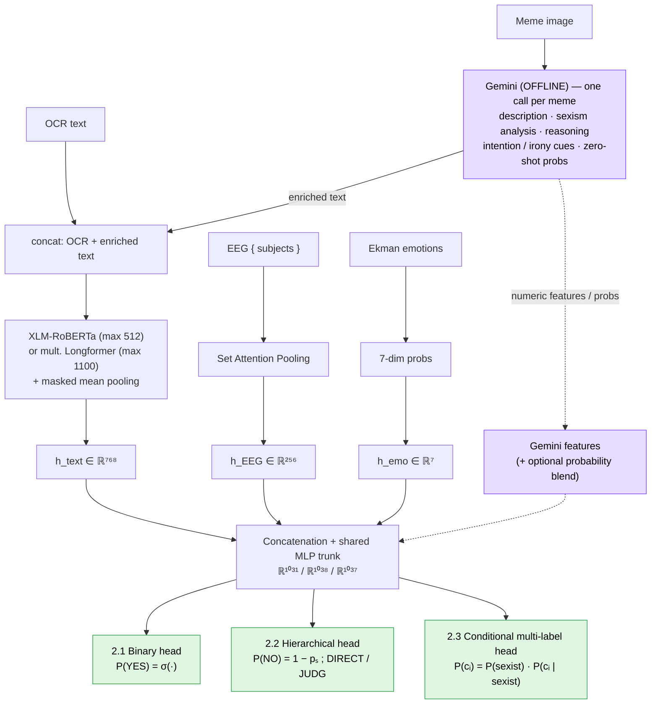

# GEMF architecture

**GEMF** (Gemini-Enriched Multimodal Fusion) is the final model family for all three subtasks. It
replaces the raw visual branch of a conventional multimodal model with **Gemini-generated text**,
and trains on **soft annotator-distribution targets**.

## 1. Learning with disagreement (soft targets)

Each meme has six human annotations. Instead of collapsing them to a majority label, the models are
trained on the **empirical annotator distribution**:

- **Task 2.1** — `y = (#YES votes) / (#valid annotations)`. A 3–3 split → target 0.5.
- **Task 2.2** — empirical distribution over `[NO, DIRECT, JUDGEMENTAL]`.
- **Task 2.3** — per-category fraction of annotators selecting that category.

Loss is binary cross-entropy with logits on continuous targets. Hard labels are obtained *from*
probabilities via validation-tuned thresholds — the model is never retrained on hard labels, so the
same model can be evaluated under both hard and soft settings.

## 2. Inputs (modality decisions)

| Modality | Dim | Final status | Why |
|---|---|---|---|
| OCR text | variable | **kept** | Main explicit text signal |
| Gemini text | variable | **kept** | Description, sexism analysis, reasoning, intention, irony, category cues |
| Gemini probabilities | task-dep. | selected runs | Auxiliary features / probability blends |
| Raw image (ViT 768) | 768 | removed | Weaker than Gemini's description |
| Eye-tracking | 24/subj | removed | No consistent gain vs. complexity |
| Heart rate | 4/subj | removed | Not informative in validation |
| **EEG** | 80/subj | **kept** | Small stable complementary signal, set-pooled |
| **Ekman emotions** | 7 | **kept** | Cheap affective signal from OCR |

## 3. Encoders and pooling

- **Text**: OCR + Gemini enriched text → XLM-RoBERTa-base (max 512) **or** multilingual Longformer
  (max 1100 tokens, for long enriched inputs). **Masked mean pooling** over tokens (more stable than
  first-token/CLS pooling, especially during the frozen warm-up) → `h_text ∈ ℝ⁷⁶⁸`.
- **EEG**: variable-size set of subject vectors → **Set Attention Pooling** (Set-Transformer style)
  → `h_EEG ∈ ℝ²⁵⁶`.
- **Ekman**: 7 emotion probabilities from OCR → `h_emo ∈ ℝ⁷` (already in [0,1], no z-score).

Fusion vector: `h = [h_text ; h_EEG ; h_emo]`.
- Task 2.1 → **ℝ¹⁰³¹** (768+256+7)
- Task 2.2 → **ℝ¹⁰³⁸** (+7 Gemini features: sexism prob, confidence, 3 intention probs, irony flag, irony conf)
- Task 2.3 → **ℝ¹⁰³⁷** (+6 Gemini features: P(sexist) + 5 category probs)

## 4. Task-specific heads

- **2.1 Binary**: `P(YES) = σ(f_MLP(h))`.
- **2.2 Hierarchical**: first `pₛ = P(sexist)`, then conditional intention; reconstructed as
  `P(NO)=1−pₛ`, `P(DIRECT)=pₛ·P(DIRECT|sexist)`, `P(JUDG)=pₛ·P(JUDG|sexist)`. Reflects that NO is
  the *absence* of sexism, not a third intention.
- **2.3 Conditional multi-label**: `P(cᵢ) = P(sexist) · P(cᵢ|sexist)` — suppresses category
  probabilities when the meme is likely non-sexist. Independent per-category sigmoids and
  category-wise thresholds.

## 5. Gemini's three roles

1. **Enriched text** concatenated with OCR (all tasks).
2. **Numerical features** at the fusion layer (Tasks 2.2 and 2.3).
3. **Probability blend** at the output (selected runs):
   - Task 2.1: `P_final = 0.6·P_model + 0.4·P_Gemini`.
   - Task 2.2: DIRECT & JUDGEMENTAL averaged model↔Gemini, then `P(NO)` reconstructed.
   - Task 2.3: no submitted run uses a blend.

## 6. Training protocol

Two phases: (1) freeze the transformer backbone, train only the head to stabilize it; (2) unfreeze
and jointly fine-tune with **differentiated learning rates** (lower for the encoder, higher for the
head), warmup+linear schedule, gradient accumulation/clipping, BF16 autocast, early stopping on the
validation ICM-Soft. Task 2.2 soft runs add Platt scaling; Task 2.3 uses category-wise thresholds
and (in some runs) WeightedRandomSampler for minority categories.

See the paper (`paper/paper_562.pdf`) §7–§9 for the formal description and
[`informe_es.md`](informe_es.md) for the detailed engineering rationale.
